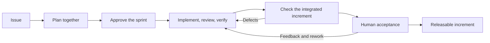

# TheOneLoop workflow

[Back to the quick start](../README.md)

## Ship an increment you can evaluate

A feature often spans data, backend, frontend, tests, and documentation. TheOneLoop keeps the pieces needed for a complete result in the same sprint. A completed sprint represents software that builds as a whole, passes its agreed regression checks, and delivers the complete feature or fix.

You choose the work to run: one story, a selection, or the entire sprint. The agent handles the technical cycle within the approved scope. You retain product decisions, all merges, and final acceptance.

TheOneLoop is designed for developers, team leads, and project owners working with coding agents such as Claude Code, Codex, OpenCode, and Pi. Its Markdown instructions travel with the workflow; delegation uses the host's capabilities, with a documented handoff to a new session when needed.

## From issue to increment



**Plan together.** The human and agent turn an issue into stories with clear scope, observable acceptance criteria, dependencies, and a verification plan. Detail the next sprint; keep later sprints as drafts that can evolve with what you learn.

**Execute the selected work.** Before implementation, the agent checks prerequisites and dependencies on the actual working branch. A blocked story stays blocked. Ready stories go through implementation, separate code review, corrections, and verification.

**Accept the whole increment.** Once every story is technically complete, verify the integrated software and present a specific candidate version to the human. Feedback reopens affected work. Release blockers keep the sprint open, even when the code is technically complete.

## What you get

| Capability | What it does for your workflow |
|---|---|
| Project readiness | Checks build, tests, environment, and other agreed prerequisites before dependent work begins. Missing foundations produce a preparation plan. |
| Collaborative planning | Converts issues into structured stories and proposes sprints around complete outcomes. |
| Selective execution | Runs one story, several stories, or the full approved sprint without silently expanding the selection. |
| Dependency checks | Requires both completed prerequisite work and its code in the working branch. Missing integration remains visible. |
| Separate code review | Uses a reviewer context separate from implementation, with findings returned for correction. |
| Bounded rework | Tracks correction attempts and stops for human direction at configurable limits or repeated lack of progress. |
| Criteria-based verification | Checks expected behavior against approved requirements and records what actually passed, failed, or could not run. |
| Tests and documentation | Includes affected tests and documentation in each story's completion criteria. |
| Integrated sprint checks | Verifies the full build, agreed regression checks, and complete functionality after stories are combined. |
| Human acceptance | Makes the final decision about requirements explicit; story-level human review remains optional. |
| Versioned evidence | Ties reviews, verification, and acceptance to identifiable code and plan versions. |
| Resumable project state | Keeps stories, decisions, blockers, and handoffs in `.theoneloop/`, ready for a fresh session. |

## Six skills, one process

| Skill | Use it to… |
|---|---|
| [theoneloop-init](../skills/theoneloop-init/SKILL.md) | Assess the project, establish a baseline, and agree on workflow settings. |
| [theoneloop-plan](../skills/theoneloop-plan/SKILL.md) | Analyze issues, define stories, and plan the next increment with the human. |
| [theoneloop-implement](../skills/theoneloop-implement/SKILL.md) | Execute selected stories through implementation, review, corrections, and verification. |
| [theoneloop-review](../skills/theoneloop-review/SKILL.md) | Review code in a separate context and reassess fixes. |
| [theoneloop-verify](../skills/theoneloop-verify/SKILL.md) | Verify individual story criteria or the integrated sprint. |
| [theoneloop-accept](../skills/theoneloop-accept/SKILL.md) | Present the increment, record human feedback, and close or reopen work. |

Install the full set for direct access to every phase, or install a single skill for its specific job. Each package contains its required references and templates. Implementation also includes review and verification instructions; acceptance includes planning instructions for requirement changes.

## Choose your Git workflow

| Mode | Branches and pull requests | Merges |
|---|---|---|
| Git · per story | The agent creates or resumes a story branch and opens a PR after technical completion. | You manage them. |
| Git · per sprint | The agent uses one sprint branch. Partial runs accumulate there; the PR is opened after all stories and integrated checks are complete. | You manage them. |
| Direct | You prepare the working branch and manage PRs yourself. The agent runs the technical cycle on that branch. | You manage them. |

Configure the workflow during initialization. Final acceptance does not automatically deploy the software.

## Keep the work with the project

```text
.theoneloop/
  config.md
  readiness.md
  issues/
  stories/
  sprints/
  evidence/
  handoffs/
```

Project documents use Markdown with YAML metadata. Read them in an editor, track them in Git, and hand them to the next session. Skill instructions are in English; project documents follow your configured language. No particular issue tracker or Git hosting provider is required by the protocol.

## Built to be inspectable

TheOneLoop is a protocol that agents follow. Its rules make missing prerequisites, incomplete checks, and unresolved feedback explicit; they are not an executable enforcement mechanism. A passing test suite provides evidence within its coverage, rather than an absolute guarantee against regressions.

The CLI package layout has been checked locally, including complete and individual installations. Full sprint execution across all target agents remains to be validated. Public-source installation and licensing are still pending. [See the validation record](publishing.md#validation-record).

## Explore and maintain

- [Read the protocol](../skills/theoneloop-init/references/protocol.md).
- [Inspect the story template](../skills/theoneloop-plan/templates/story.md) and [sprint template](../skills/theoneloop-plan/templates/sprint.md).
- [Understand project documents](../skills/theoneloop-init/references/documents.md).
- [Maintain the packages](maintaining.md) or [prepare a public release](publishing.md).
